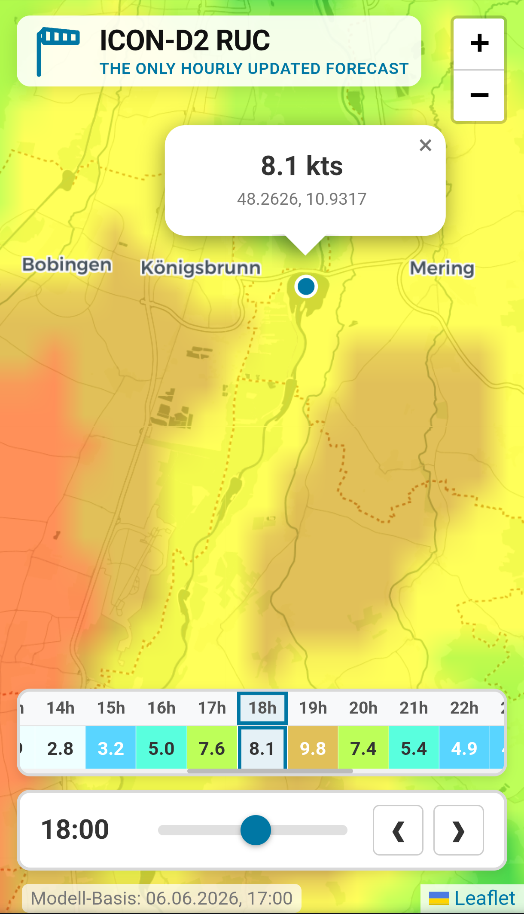

# Interactive DWD ICON-D2 RUC & AROME PI 2.5 km Wind Map

The app visualizes localized wind forecast data for **Germany** and nearby regions. You can switch between **ICON-D2 RUC** and **AROME PI 2.5 km** using the logo row.

The project uses the **ICON-D2 RUC (Rapid Update Cycle)** model provided by the Deutscher Wetterdienst (DWD) and **AROME PI 2.5 km** via Open-Meteo using Météo-France model data. The map overlay utilizes a custom color-scale optimized for the specific velocity ranges relevant to kite and wing foiling.

To our knowledge, this is a **unique free implementation** providing hourly updated, interactive point-forecast queries from these high-resolution models.

[See my article on medium for some more background](https://medium.com/@christianzink/why-standard-wind-forecasts-fail-the-power-of-dwds-icon-d2-ruc-model-for-wind-sports-acf2ebd88412?sharedUserId=christianzink)

[Related: kitespots.zink.tv](https://kitespots.zink.tv)

> ⚠️ **Disclaimer:** This project is experimental and currently in active development.

---

## Technical Specifications & Advantages of ICON-D2 RUC
Most mainstream consumer weather applications render global or regional models with coarse resolution and slow update cycles. This application visualizes the DWD's premier high-resolution local model:

| Parameter | ICON-D2 RUC | Standard Global Models (e.g., GFS) |
| :--- | :--- | :--- |
| **Horizontal Resolution** | **2.2 km** grid | 13 km – 27 km grid |
| **Update Cycle** | **Hourly (Every 60 minutes)** | Every 6 hours |
| **Data Assimilation** | **Rapid Update Cycle (RUC)** (Continuous assimilation of local radar & station observations) | Intermittent batch assimilation |
| **Forecast Range** | 0 to 14 hours | Multi-day extended range |

### Application for Foiling:

Micro-climatic shifts, thermal winds, and localized frontal systems near lakes or coastal structures are typically lost in >10km grids. The 2.2 km resolution of the ICON-D2 RUC model captures these thermodynamic anomalies. Updating the dataset hourly ensures near-term tactical wind window forecasts remain accurate.

AROME PI 2.5 km adds another high-resolution option for nearby regions via Open-Meteo and Météo-France model data.

---

## Architecture & Data Pipeline

The project implements a decoupled, entirely serverless **Two-Repository Architecture** to eliminate backend hosting costs while maintaining high data throughput.

### 1. Data Ingestion & Extraction (`weather-data`)
* **Pipeline Branch (`main`):** A Python-based script triggered hourly via GitHub Actions fetches the latest GRIB2 payload from the DWD Open Data servers.
* **Processing:** The pipeline crops the dataset to the target geographic bounding box, extracts wind speed arrays, and serializes the matrix data.
* **Storage Branch (`gh-pages`):** The extracted data slices are pushed as static JSON structures to the [gh-pages branch](https://github.com/Chriz76/weather-data/tree/gh-pages), acting as a decentralized, free-tier CDN.

### 2. Frontend Visualization (`weather-map`)
* The client-side application loads the lightweight spatial arrays on-demand based on the user's selected timeline node.
* **Coordinate Interpolation:** When a user interacts with the map interface, the application translates the mouse pointer's geospatial coordinate (Latitude/Longitude) to extract the precise point-forecast value from the underlying data matrix.

---

## Development & Contribution

As this is an experimental project, contributions to optimize the JSON chunking sizes, improve the UI performance under heavy mobile rendering conditions, or add vector-based wind direction overlays are welcome.

This project is a private, free, and ad-free open-source web app. It is maintained strictly for hobby purposes and pursues no commercial interests.

* **Data Attribution:** Deutscher Wetterdienst (DWD) - OpenData.
* **AROME Attribution:** [Open-Meteo](https://open-meteo.com/) using [Météo-France](https://meteofrance.com/) model data.
* **Author:** [Chriz76](https://github.com/Chriz76)

## Testing with Jasmine

A browser-based Jasmine test runner is available in `tests/index.html`.

To run the tests:

1. Start a local HTTP server in the project root.
   - Example: `python -m http.server 8000`
2. Open `http://127.0.0.1:8000/tests/index.html` in your browser.

> ES modules require an HTTP or HTTPS context, so opening the HTML file directly via `file://` will not work.

The current test files are:

* `tests/spec/time.spec.js`
* `tests/spec/interpolation.spec.js`
* `tests/spec/weatherUi.spec.js`

## 📄 License & Terms of Use

* **Meteorological Data Source:** Deutscher Wetterdienst (DWD) – OpenData terms apply to the underlying forecast parameters.
* **Software License:** Copyright © 2026 by Chriz76. All rights reserved. 
  
This application is provided **free of charge** for personal and recreational use (e.g., wind/wing foiling planning). However, the source code, custom processing pipelines, and frontend logic remain the intellectual property of the author. You may not redistribute, modify, or commercially exploit this codebase without explicit written permission.

## Privacy Policy

Because your privacy matters, this web app does not collect, store, or track any of your personal data. We do not use any marketing or tracking cookies, and there is no user registration required to use this app.

However, to provide this web app in a stable, secure, and fast manner, we rely on modern cloud infrastructure. Due to technical requirements, a minimal amount of data processing occurs automatically in the background:

### 1. Hosting via GitHub Pages
This web app is hosted as a static site on GitHub Pages (Service Provider: GitHub Inc., 88 Colin P Kelly Jr St, San Francisco, CA 94107, USA; Parent Company: Microsoft Corporation). When you access this app, GitHub automatically collects standard server log files (including your IP address, browser type, and the date and time of access). This is technically necessary to deliver the page securely and to prevent cyber attacks. GitHub/Microsoft is certified under the EU-US Data Privacy Framework, ensuring a GDPR-compliant level of data protection.

### 2. Security & Content Delivery Network via Cloudflare
Additionally, we use the Content Delivery Network (CDN) provided by Cloudflare (Service Provider: Cloudflare Inc., 101 Townsend St, San Francisco, CA 94107, USA). Cloudflare acts as a security shield between our host server and your browser. During this process, your IP address is briefly processed to block malicious traffic (e.g., DDoS attacks) and to optimize page loading speeds globally. Cloudflare may set technically necessary cookies for security purposes, which do not create user profiles. Cloudflare is also certified under the EU-US Data Privacy Framework.

**Legal Basis:** The use of these third-party services is based on our legitimate interest (Art. 6 Abs. 1 lit. f GDPR) to offer this hobby project in a secure, high-performing, and reliable manner on the internet.
